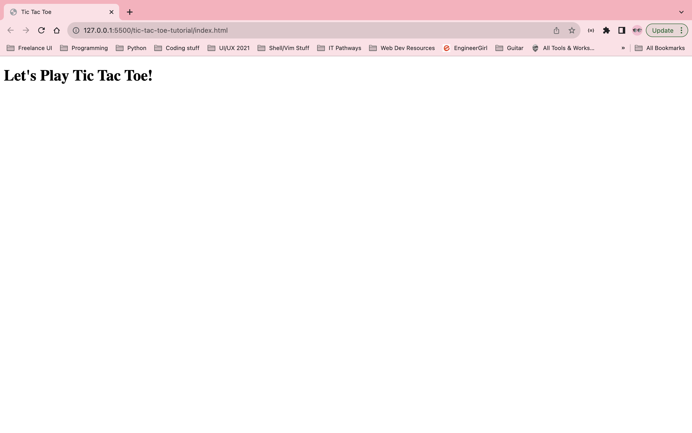
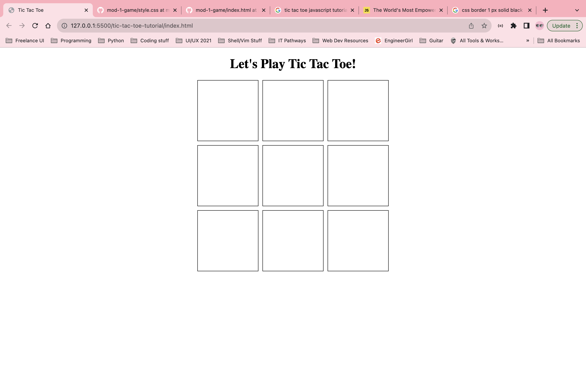
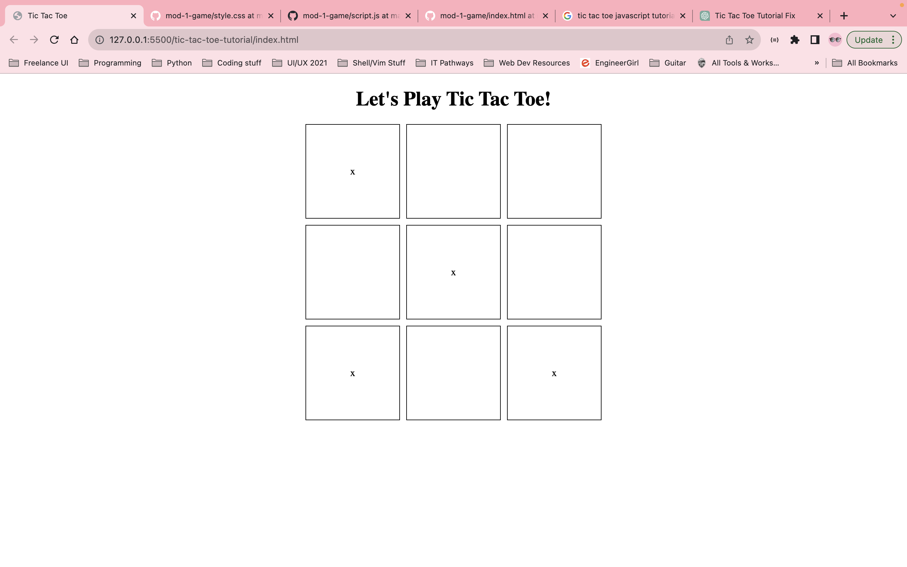
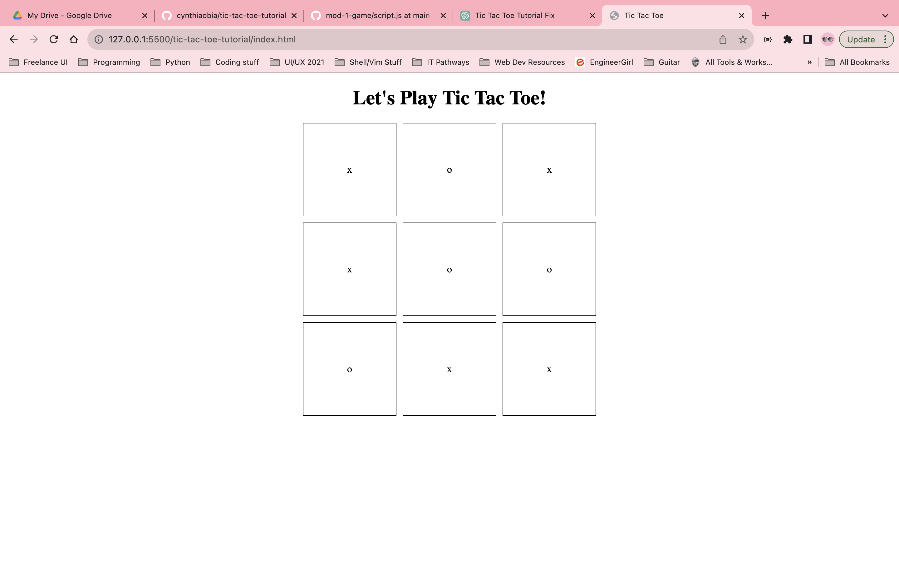
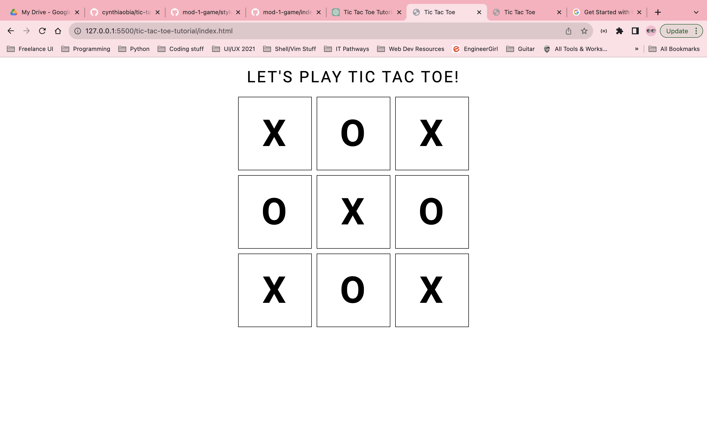
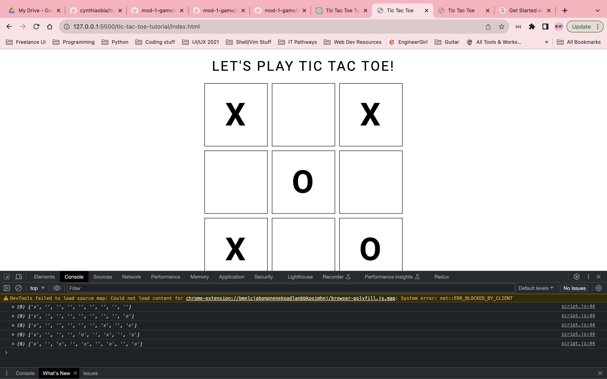
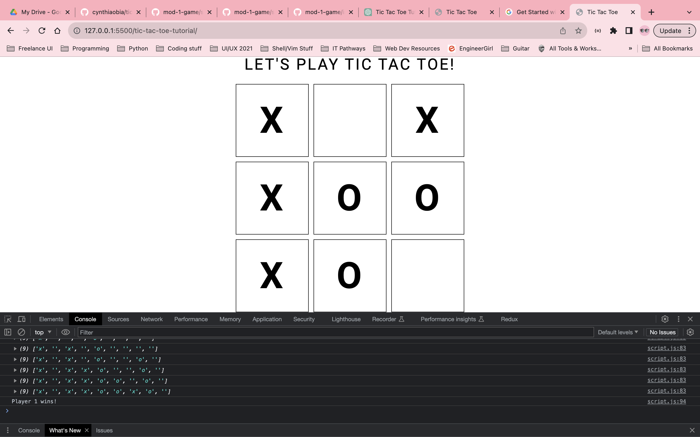
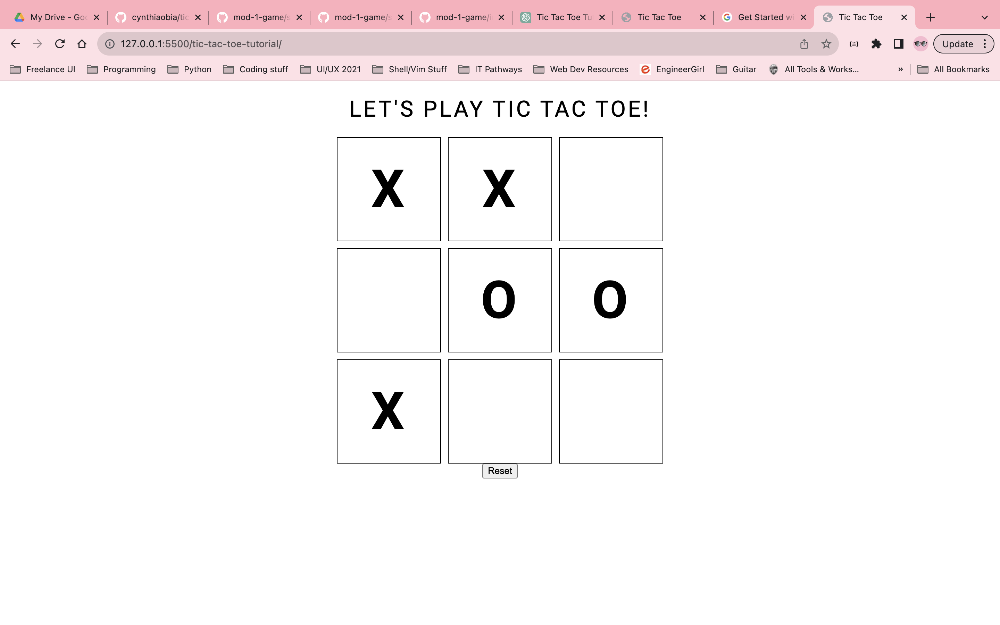

# Tic Tac Toe Tutorial | Part 1

Pre-requisites:
* HTML
* CSS
* JavaScript
* DOM Manipulation

Goals: Revisit HTML5, CSS3 concepts (grid/flexbox). Implement JS logic and introduce use of DOM manipulation. Use imports for fonts.

In this 3 part tutorial, you'll learn how to re-create the classic Tic Tac Toe game in a 2 player format in a stylish way with interactive alerts. With a bonus part 4 to change themes via dom manipulation.

First we'll start with our HTML boilerplate. Let's create a new file ```index.html``` with the following title and h1 tags:

```
<!DOCTYPE html>
<html lang="en">
<head>
  <meta charset="UTF-8">
  <meta name="viewport" content="width=device-width, initial-scale=1.0">
  <title>Tic Tac Toe</title>
</head>
<body>

  <h1>Let's Play Tic Tac Toe!</h1>
  
</body>
</html>
```

We can view our code so far in our browser by navigating to /index.html via live server extension on VS Code: 



Great! now we can verify and see everything is up and running correctly!

Next, we'll move on to creating the board and adding some basic styling using CSS grid.

In our html we'll display the board using the following code:

We're setting up our board to be styled with css. In an effort to be more semantic, we've given the main board a class of ```board``` and each of the boxes that we'll place our marks in have a class of ```square```. This will set us up for our CSS grid/flexbox. An id is assigned to each box to aid us in dom manipulation later. These IDs are semantic because they will correlate with the indexes that we'll use in the javascript later on.

index.html

```
<!-- Tic Tac Toe Board -->
<div class="board">
  <div class="square" id="0"></div>
  <div class="square" id="1"></div>
  <div class="square" id="2"></div>
  <div class="square" id="3"></div>
  <div class="square" id="4"></div>
  <div class="square" id="5"></div>
  <div class="square" id="6"></div>
  <div class="square" id="7"></div>
  <div class="square" id="8"></div>
</div>

```

Now let's create a new file for our stylesheet called ```style.css```

Below is the code that we'll use to style the board via CSS grid. Remember the naming conventions that we mentioned above which we'll use later:

```
body {
  margin: 0 auto;
  text-align: center;
}

/* creating board */

.board {
  display: grid;
  grid-gap: 10px;
  grid-template-columns: repeat(3, 150px);
  grid-template-rows: repeat(3, 150px);
  place-content: center;
}

.square {
  display: grid;
  border: 1px solid black;
  place-items: center;
}
```

And now we'll link our style sheet in our html by putting the following in the ```<head>``` tag of ```index.html```:

```
<link rel="stylesheet" href="style.css">
```

Now you should have a nicely centered board in a 3x3 grid format:



This is a good display for now. We'll do more later to spice it up.

Next we'll move onto some javascript and dom manipulation. We want to be able to place a mark on the square that we click. in our event handler, we'll call the function.

create a new file called script.js and we'll see how we can change the text content of a square after clicking within it.

```
// Place marks on board
function handleSquareClick(e) {
  // Prevent page from re-loading after clicks
  e.preventDefault();

  const square = e.target;

  // Check if area clicked is a square and not any other part of document page
  if (square.className === 'square'){
    square.textContent = 'x';
  }
}

document.addEventListener('click', handleSquareClick);

```

now link it in ```index.html``` head with this:
```
<script src="script.js" defer></script>
```

So now, if you click on any square, it will place an x in it. if you click outside the squares, there won't be any changes made to the page. Let's test this out: click on squares on the board and it should place an x. If you click outside the page nothing will change.



now we'll take it a step further and add two player objects with properties for mark, isTurn, and win. Working in our ```script.js``` we'll add the following to initialize our players:

```
//Initializing players

const player1 = {
  marker: 'x',
  isTurn: true,
  win: false
}

const player2 = {
  marker: 'o',
  isTurn: false,
  win: false
}
```

Now we are going to edit our ```handleSquareClick``` function to alternate turns and change each player's ```isTurn``` state using an if statement conditional block, and to prevent each player from placing a mark in a square that's already been marked, we will make sure the text content of the square is equivalent to an empty string so we don't overwrite previous marks: 

```
// Function to mark the board and alternate isTurns
function handleSquareClick(e) {
  // Prevent the page from re-loading after clicks
  e.preventDefault();

  const square = e.target;

  // Check if the clicked area is a square, unmarked, and not any other part of the document page
  if (square.className === 'square' && square.textContent === '') {
    if (player1.isTurn) {
      square.textContent = player1.marker;
    } else if (player2.isTurn) {
      square.textContent = player2.marker;
    }

    // Toggle player turns
    player1.isTurn = !player1.isTurn;
    player2.isTurn = !player2.isTurn;
  }
}
```
Test it out in your browser and you should now be able to see that we can take turns placing marks in empty squares!



Every things is working as expected so far, though it's looking a little bland. We'll add some additional simple CSS to spice it up some more.

To do this we're going to use a Google Font which we'll be importing as a link. Google Fonts is great for free custom fonts. If you'd like to learn more about using Google Fonts you can visit this link: https://developers.google.com/fonts/docs/getting_started

So first let's add this code to import the font in the ```head``` of ```index.html```:

```
<link rel="preconnect" href="https://fonts.googleapis.com">
<link rel="preconnect" href="https://fonts.gstatic.com" crossorigin>
<link href="https://fonts.googleapis.com/css2?family=Roboto:wght@100;300;400;500;700&display=swap" rel="stylesheet">
```

Here, I've chosen the "Roboto" font (https://fonts.google.com/specimen/Roboto) and a few font weights.

Now let's customize the font's style by updating the code of the ```body``` selector in ```style.css```:

```
body {
  margin: 0 auto;
  text-align: center;
  font-family: 'Roboto', sans-serif;
  text-transform: uppercase;
  letter-spacing: .2em;
}
```
We'll add an ```h1``` selector with the following styling:

```
h1 {
  font-weight: 400;
}
```

And we'll update the ```.board``` class to the following:
```
.board {
  display: grid;
  grid-gap: 10px;
  grid-template-columns: repeat(3, 150px);
  grid-template-rows: repeat(3, 150px);
  place-content: center;
  font-weight: 700;
  font-size: 75px;
}
```
It's already looking a lot better!



Now let's return to the ```script.js``` so that we can work on the logic of the game.

We'll need a way to track our marks in an array so that we can check the indices to determine the win/lose/draw states. We'll fill in the array with the players' markers to do so. In tic tac toe we know that there are 8 total winning combinations: 3 vertically, 3 horizontally, and 2 diagonally. Here is a visual reprecentation of the indices of a tic tac toe board:
```
0 1 2
3 4 5
6 7 8
```
For a horizontal win the combination needs to be ```0 1 2```, ```3 4 5```, or ```6 7 8```. For vertical, the combination needs to be ```0 3 6```, ```1 4 7```, ```2 5 8```. and for diagonal the combination needs to be ``0 4 8`` or ```2 4 6```.

Lets create an array to track the marks. It will have 9 elements, all of which are empty strings:
```
let trackMarks = ['', '', '', '', '', '', '', '', '']
```

Now we'll start filling up the array with the help of some DOM Manipulation. We'll need to reference the IDs of each square from the html to do this. In the ```trackMarks``` array, we'll update the appropriate index with the player's mark. We also want to verify ```trackMarks``` is updating so we'll use ```console.log()``` to see the staus of the array. Update the ```handleSquareClick``` function to the following:

```
  // Check if the clicked area is a square, unmarked, and not any other part of the document page
  if (square.className === 'square' && square.textContent === '') {

    // creating index from square
    let i = square.id;

    // update board with correct player mark, update track marks array with players' markers
    if (player1.isTurn) {
      square.textContent = player1.marker;
      trackMarks[i] = player1.marker;
    } else if (player2.isTurn) {
      square.textContent = player2.marker;
      trackMarks[i] = player2.marker;
    }
    
    // checking updated values of trackMarks
    console.log(trackMarks);

    // Toggle player turns
    player1.isTurn = !player1.isTurn;
    player2.isTurn = !player2.isTurn;
  }
```

Now when we click the squares, we should see the console updating with each click and coinciding with the correct index in the array. Let's open up our dev tools and go to our console to see this happening in real time:



Now let's determine the winning states. We don't want the board to fill up any further if a player has won. If a player has won or a tie has occurred, we'll disable the players' abilities to continue to click on the board and add a mark. Since we know our winning combinations according to what was mentioned previously, we'll implement the following logic to determine the win/lose/draw states.

Let's add an array for the winning combinations and initialize a variable ```gamOver```  to the state false at the start of a game. We'll also create an array for the winning combinations:

```
// initialize game state
let gameOver = false;

const winningCombinations = [
  // HORIZONTAL WINS
  [0, 1, 2],
  [3, 4, 5],
  [6, 7, 8],
  // VERTICAL WINS
  [0, 3, 6],
  [1, 4, 7],
  [2, 5, 8],
  // DIAGONAL WINS
  [0, 4, 8],
  [2, 4, 6]
];
```

Now we'll work on creating a function to check if a player has won or if a tie has occured. This will change the ```gameOver``` state to true and return a gameState object containing the ```gameOver``` and the players' win states:

```
// Function to check the game state (win, lose, or tie)
function checkGameState() {
  for (const combination of winningCombinations) {
    const [a, b, c] = combination;
    if (trackMarks[a] && trackMarks[a] === trackMarks[b] && trackMarks[b] === trackMarks[c]) {
      gameOver = true; // Set gameOver to true when a player wins
      if (trackMarks[a] === 'x') {
        player1.win = true;
      } else if (trackMarks[a] === 'o') {
        player2.win = true;
      }
    }
  }

  // Check for a tie
  if (!gameOver && trackMarks.includes('') === false ) {
    gameOver = true; // Set gameOver to true when it's a tie
  }

  return { gameOver, player1Win: player1.win, player2Win: player2.win };
}
```

We'll call this function inside ```handleSquareClick``` to check for a win after each round and disable further play if the game is over. We'll also add some ```console.log```s so that we can see what's happening and verify that everything is working correctly. Update the ```handleSquareClick``` with the following code:

```
// Function to mark the board and alternate yurns
function handleSquareClick(e) {
  // Prevent the page from re-loading after clicks
  e.preventDefault();

  const square = e.target;

  // Check if the clicked area is a square, unmarked, and not any other part of the document page
  if (square.className === 'square' && square.textContent === '' && gameOver === false) {

    // creating index from square
    let i = square.id;

    // update board with correct player mark, update track marks array with players' markers
    if (player1.isTurn) {
      square.textContent = player1.marker;
      trackMarks[i] = player1.marker;
    } else if (player2.isTurn) {
      square.textContent = player2.marker;
      trackMarks[i] = player2.marker;
    }
    
    // checking updated values of trackMarks
    console.log(trackMarks);

    // Toggle player turns
    player1.isTurn = !player1.isTurn;
    player2.isTurn = !player2.isTurn;
  }

  const gameState = checkGameState();

  if (gameState.gameOver) {
    if (gameState.player1Win) {
      console.log("Player 1 wins!");
    } 
    else if (gameState.player2Win) {
      console.log("Player 2 wins!");
    } 
    else {
      console.log("It's a tie!");
    }

    // Disable further clicks or perform any other end-of-game actions here.
  }
}
```

Awesome! Now we have a fully functioning Tic Tac Toe Game with the correct logic and the ability to manipulate the DOM. You can go a head and play the game and test it out for yourself. Each player should be able to alternate turns and place a mark on the board until the game is over. Once the game is over, you'll see this status of the game logged to the console like so:



Okay, so the game is over. What if we want to play again? Well we'll add a button with an event listener to call the ```resetBoard``` function once it's clicked and reset the game. This will clear the board, change the ```gameOver``` state back to false, empty the ```markTracks``` array, and rest the ```isTurn``` and ```win``` state of each of the players.

Lets add the following code to our ```index.html``` after the ```board``` div:

```
<div>
  <button class="reset-btn">Reset</button>
</div>
```

And in our ```script.js``` we'll add the following code which will use DOM manipulation to select the reset button and call the ```resetBoard```function when its clicked:

```
// RESET BOARD
const resetButton = document.querySelector('.reset-btn');
resetButton.addEventListener('click', resetBoard);

function resetBoard() {
  const squares = document.querySelectorAll('.square');
  // clear board on UI
  for (let square of squares) {
      square.textContent = '';
  }

  // reset player 1
  player1.isTurn = true;
  player1.win = false;

  // reset player 2
  player2.isTurn = false;
  player2.win = false;

  // reset board and game
  trackMarks = ['', '', '', '', '', '', '', '', ''];
  gameOver = false;

  // clear previous messages from console
  console.clear()
}
```

Now you should see a reset button below the board and if you click it at any point in the game it will reset the whole game:



And there you have it! We have a fully functioning tic tac toe game with the ability to reset the board and play as many games as your heart desires!

Here is the code for the files we created:

index.html
```
<!DOCTYPE html>
<html lang="en">
<head>
  <meta charset="UTF-8">
  <meta name="viewport" content="width=device-width, initial-scale=1.0">
  <link rel="stylesheet" href="style.css">
  <link rel="preconnect" href="https://fonts.googleapis.com">
  <link rel="preconnect" href="https://fonts.gstatic.com" crossorigin>
  <link href="https://fonts.googleapis.com/css2?family=Roboto:wght@100;300;400;500;700&display=swap" rel="stylesheet">
  <script src="script.js" defer></script>
  <title>Tic Tac Toe</title>
</head>
<body>

  <h1>Let's Play Tic Tac Toe!</h1>
  
    <!-- Tic Tac Toe Board -->
    <div class="board">
      <div class="square" id="0"></div>
      <div class="square" id="1"></div>
      <div class="square" id="2"></div>
      <div class="square" id="3"></div>
      <div class="square" id="4"></div>
      <div class="square" id="5"></div>
      <div class="square" id="6"></div>
      <div class="square" id="7"></div>
      <div class="square" id="8"></div>
    </div>

    <div>
      <button class="reset-btn">Reset</button>
    </div>

</body>
</html>
```

style.css

```
body {
  margin: 0 auto;
  text-align: center;
  font-family: 'Roboto', sans-serif;
  text-transform: uppercase;
  letter-spacing: .2em;
}

h1 {
  font-weight: 400;
}

/* creating board */
.board {
  display: grid;
  grid-gap: 10px;
  grid-template-columns: repeat(3, 150px);
  grid-template-rows: repeat(3, 150px);
  place-content: center;
  font-weight: 700;
  font-size: 75px;
}

.square {
  display: grid;
  border: 1px solid black;
  place-items: center;
}
```

script.js

```

//Initializing players

const player1 = {
  marker: 'x',
  isTurn: true,
  win: false
}

const player2 = {
  marker: 'o',
  isTurn: false,
  win: false
}

// initialize empty array of marks
let trackMarks = ['', '', '', '', '', '', '', '', ''];

// initialize game state
let gameOver = false;

// determine winning combinations
const winningCombinations = [
  // HORIZONTAL WINS
  [0, 1, 2],
  [3, 4, 5],
  [6, 7, 8],
  // VERTICAL WINS
  [0, 3, 6],
  [1, 4, 7],
  [2, 5, 8],
  // DIAGONAL WINS
  [0, 4, 8],
  [2, 4, 6]
];

// Function to check the game state (win, lose, or tie)
function checkGameState() {
  for (const combination of winningCombinations) {
    const [a, b, c] = combination;
    if (trackMarks[a] && trackMarks[a] === trackMarks[b] && trackMarks[b] === trackMarks[c]) {
      gameOver = true; // Set gameOver to true when a player wins
      if (trackMarks[a] === 'x') {
        player1.win = true;
      } else if (trackMarks[a] === 'o') {
        player2.win = true;
      }
    }
  }

  // Check for a tie
  if (!gameOver && trackMarks.includes('') === false ) {
    gameOver = true; // Set gameOver to true when it's a tie
  }

  return { gameOver, player1Win: player1.win, player2Win: player2.win };
}

// Function to mark the board and alternate turns
function handleSquareClick(e) {
  // Prevent the page from re-loading after clicks
  e.preventDefault();

  const square = e.target;

  // Check if the clicked area is a square, unmarked, and not any other part of the document page
  if (square.className === 'square' && square.textContent === '' && gameOver === false) {

    // creating index from square
    let i = square.id;

    // update board with correct player mark, update track marks array with players' markers
    if (player1.isTurn) {
      square.textContent = player1.marker;
      trackMarks[i] = player1.marker;
    } else if (player2.isTurn) {
      square.textContent = player2.marker;
      trackMarks[i] = player2.marker;
    }
    
    // checking updated values of trackMarks
    console.log(trackMarks);

    // Toggle player turns
    player1.isTurn = !player1.isTurn;
    player2.isTurn = !player2.isTurn;
  }

  const gameState = checkGameState();

  if (gameState.gameOver) {
    if (gameState.player1Win) {
      console.log("Player 1 wins!");
    } 
    else if (gameState.player2Win) {
      console.log("Player 2 wins!");
    } 
    else {
      console.log("It's a tie!");
    }

    // Disable further clicks or perform any other end-of-game actions here.
  }
}


document.addEventListener('click', handleSquareClick);

// RESET BOARD
const resetButton = document.querySelector('.reset-btn');
resetButton.addEventListener('click', resetBoard);

function resetBoard() {
  const squares = document.querySelectorAll('.square');
  // clear board on UI
  for (let square of squares) {
      square.textContent = '';
  }

  // reset player 1
  player1.isTurn = true;
  player1.win = false;

  // reset player 2
  player2.isTurn = false;
  player2.win = false;

  // reset board and game
  trackMarks = ['', '', '', '', '', '', '', '', ''];
  gameOver = false;

  // clear previous messages from console
  console.clear()
}

```

For the second part of this tutorial, we will be adding more styling to make the game more visually appealing. 


Published on: Date Here
About the author: Cynthia Obia studied computational mathematics @ Michigan University and is a Software Engineer specializing in Full Stack Development. Also passionate about UI design, tools used most are MERN.

--------

Here's the proofread tutorial:

---

# Tic Tac Toe Tutorial | Part 1

**Prerequisites:**
- HTML
- CSS
- JavaScript
- DOM Manipulation

**Goals:** Revisit HTML5 and CSS3 concepts (grid/flexbox), implement JavaScript logic, and introduce DOM manipulation. Use imports for fonts.

In this three-part tutorial, you'll learn how to recreate the classic Tic Tac Toe game in a 2-player format, presented in a stylish way with interactive alerts. In a bonus Part 4, we'll explore changing themes via DOM manipulation.

## HTML Boilerplate

Let's start with the HTML boilerplate. Create a new file named `index.html` and add the following code for the title and h1 tags:

```html
<!DOCTYPE html>
<html lang="en">
<head>
  <meta charset="UTF-8">
  <meta name="viewport" content="width=device-width, initial-scale=1.0">
  <title>Tic Tac Toe</title>
</head>
<body>

  <h1>Let's Play Tic Tac Toe!</h1>
  
</body>
</html>
```

To view your code in a browser, navigate to `/index.html`. (If you are using VS Code, you can do this using the Live Server extension)


## Creating the Game Board

Now, let's create the game board and add some basic styling using CSS grid. In the HTML, add the following code for the game board:

```html
<!-- Tic Tac Toe Board -->
<div class="board">
  <div class="square" id="0"></div>
  <div class="square" id="1"></div>
  <div class="square" id="2"></div>
  <div class="square" id="3"></div>
  <div class="square" id="4"></div>
  <div class="square" id="5"></div>
  <div class="square" id="6"></div>
  <div class="square" id="7"></div>
  <div class="square" id="8"></div>
</div>
```

Now, create a new file for your stylesheet called `style.css` and add the following CSS code to style the game board:

```css
body {
  margin: 0 auto;
  text-align: center;
}

/* Styling for the game board */
.board {
  display: grid;
  grid-gap: 10px;
  grid-template-columns: repeat(3, 150px);
  grid-template-rows: repeat(3, 150px);
  place-content: center;
}

.square {
  display: grid;
  border: 1px solid black;
  place-items: center;
}
```

Link your stylesheet in the `<head>` section of your HTML:

```html
<link rel="stylesheet" href="style.css">
```

Now, you should have a nicely centered game board in a 3x3 grid format.


## Adding JavaScript for Player Interaction

Next, let's add JavaScript to enable players to place their marks on the squares when clicked. Create a new file called `script.js` and add the following code:

```javascript
// Place marks on the board
function handleSquareClick(e) {
  // Prevent the page from re-loading after clicks
  e.preventDefault();

  const square = e.target;

  // Check if the clicked area is a square and not any other part of the document page
  if (square.className === 'square'){
    square.textContent = 'x'; // For player 1, you can modify this for player 2
  }
}

document.addEventListener('click', handleSquareClick);
```

Link the JavaScript file in the `<head>` section of your HTML with the `defer` attribute:

```html
<script src="script.js" defer></script>
```

Now, clicking on any square should place an 'x' in it. If you click outside the squares, nothing will change.


## Implementing Player Logic

Let's take it a step further and add two player objects with properties for mark, isTurn, and win. In your `script.js`, initialize the players like this:

```javascript
// Initializing players
const player1 = {
  marker: 'x',
  isTurn: true,
  win: false
}

const player2 = {
  marker: 'o',
  isTurn: false,
  win: false
}
```

Now, we'll edit the `handleSquareClick` function to alternate turns and ensure that a player can't place a mark in a square that's already marked. Update the function as follows:

```javascript
// Function to mark the board and alternate turns
function handleSquareClick(e) {
  // Prevent the page from re-loading after clicks
  e.preventDefault();

  const square = e.target;

  // Check if the clicked area is a square, unmarked, and not any other part of the document page
  if (square.className === 'square' && square.textContent === '') {
    if (player1.isTurn) {
      square.textContent = player1.marker;
    } else if (player2.isTurn) {
      square.textContent = player2.marker;
    }

    // Toggle player turns
    player1.isTurn = !player1.isTurn;
    player2.isTurn = !player2.isTurn;
  }
}
```

Now, you can take turns placing marks in empty squares.


## Step 5: Adding Styling with Google Fonts

To make the game look better, let's add some additional styling using Google Fonts. Add the following code to import the font in the `<head>` of your HTML:

```html
<link rel="preconnect" href="https://fonts.googleapis.com">
<link rel="preconnect" href="https://fonts.gstatic.com" crossorigin>
<link href="https://fonts.googleapis.com/css2?family=Roboto:wght@100;300;400;500;700&display=swap" rel="stylesheet">
```

Now, customize the font's style by updating the `body` selector in your `style.css`:

```css
body {
  margin: 0 auto;
  text-align: center;
  font-family: 'Roboto', sans-serif;
  text-transform: uppercase;
  letter-spacing: .2em;
}
```

Also, update the `.board` class to style the game board:

```css
.board {
  display: grid;
  grid-gap: 10px;
  grid-template-columns: repeat(3, 150px);
  grid-template-rows: repeat(3, 150px);
  place-content: center;
  font-weight: 700;
  font-size: 75px;
}
```

Now, your game should have a better visual appeal.


## Implementing Win and Tie Logic

Let's implement win and tie logic. Create an array to track the marks and determine winning combinations. Initialize a variable `gameOver` to `false` at the start of the game. Also, define the winning combinations:

```javascript
// Initialize empty array of marks
let trackMarks = ['', '', '', '', '', '', '', '', ''];

// Initialize game state
let gameOver = false;

// Define winning combinations
const winningCombinations = [
  // HORIZONTAL WINS
  [0, 1, 2],
  [3, 4, 5],
  [6, 

7, 8],
  // VERTICAL WINS
  [0, 3, 6],
  [1, 4, 7],
  [2, 5, 8],
  // DIAGONAL WINS
  [0, 4, 8],
  [2, 4, 6]
];
```

Create a function to check the game state (win, lose, or tie):

```javascript
// Function to check the game state (win, lose, or tie)
function checkGameState() {
  for (const combination of winningCombinations) {
    const [a, b, c] = combination;
    if (trackMarks[a] && trackMarks[a] === trackMarks[b] && trackMarks[b] === trackMarks[c]) {
      gameOver = true; // Set gameOver to true when a player wins
      if (trackMarks[a] === 'x') {
        player1.win = true;
      } else if (trackMarks[a] === 'o') {
        player2.win = true;
      }
    }
  }

  // Check for a tie
  if (!gameOver && !trackMarks.includes('')) {
    gameOver = true; // Set gameOver to true when it's a tie
  }

  return { gameOver, player1Win: player1.win, player2Win: player2.win };
}
```

Call this function inside `handleSquareClick` to check for a win after each round and disable further play if the game is over:

```javascript
// Function to mark the board and alternate turns
function handleSquareClick(e) {
  // Prevent the page from re-loading after clicks
  e.preventDefault();

  const square = e.target;

  // Check if the clicked area is a square, unmarked, and not any other part of the document page
  if (square.className === 'square' && square.textContent === '' && !gameOver) {
    // ... (rest of the code)

    const gameState = checkGameState();

    if (gameState.gameOver) {
      if (gameState.player1Win) {
        console.log("Player 1 wins!");
      } else if (gameState.player2Win) {
        console.log("Player 2 wins!");
      } else {
        console.log("It's a tie!");
      }

      // Disable further clicks or perform any other end-of-game actions here.
    }
  }
}
```

Now when we click the squares, we should see the console updating with each click and coinciding with the correct index in the array. Let's open up our dev tools and go to the console to see this happening in real time:


## Adding a Reset Button

To allow players to start a new game, add a "Reset" button with an event listener to call the `resetBoard` function when clicked. This function clears the board and resets the game. Add the following code below the game board in your `index.html`:

```html
<div>
  <button class="reset-btn">Reset</button>
</div>
```

In your `script.js`, select the reset button and add the event listener:

```javascript
// RESET BOARD
const resetButton = document.querySelector('.reset-btn');
resetButton.addEventListener('click', resetBoard);

function resetBoard() {
  const squares = document.querySelectorAll('.square');
  // Clear the board on the UI
  for (let square of squares) {
    square.textContent = '';
  }

  // Reset player 1
  player1.isTurn = true;
  player1.win = false;

  // Reset player 2
  player2.isTurn = false;
  player2.win = false;

  // Reset the board and game
  trackMarks = ['', '', '', '', '', '', '', '', ''];
  gameOver = false;

  // Clear previous messages from the console
  console.clear();
}
```

Now, you have a reset button below the board to start a new game.

Congratulations! You've created a fully functioning Tic Tac Toe game with JavaScript logic, DOM manipulation, and basic styling.

Here's the code for the files:

**index.html:**

```html
<!DOCTYPE html>
<html lang="en">
<head>
  <meta charset="UTF-8">
  <meta name="viewport" content="width=device-width, initial-scale=1.0">
  <link rel="stylesheet" href="style.css">
  <link rel="preconnect" href="https://fonts.googleapis.com">
  <link rel="preconnect" href="https://fonts.gstatic.com" crossorigin>
  <link href="https://fonts.googleapis.com/css2?family=Roboto:wght@100;300;400;500;700&display=swap" rel="stylesheet">
  <script src="script.js" defer></script>
  <title>Tic Tac Toe</title>
</head>
<body>

  <h1>Let's Play Tic Tac Toe!</h1>
  
  <!-- Tic Tac Toe Board -->
  <div class="board">
    <div class="square" id="0"></div>
    <div class="square" id="1"></div>
    <div class="square" id="2"></div>
    <div class="square" id="3"></div>
    <div class="square" id="4"></div>
    <div class="square" id="5"></div>
    <div class="square" id="6"></div>
    <div class="square" id="7"></div>
    <div class="square" id="8"></div>
  </div>

  <div>
    <button class="reset-btn">Reset</button>
  </div>

</body>
</html>
```

**style.css:**

```css
body {
  margin: 0 auto;
  text-align: center;
  font-family: 'Roboto', sans-serif;
  text-transform: uppercase;
  letter-spacing: .2em;
}

/* Styling for the game board */
.board {
  display: grid;
  grid-gap: 10px;
  grid-template-columns: repeat(3, 150px);
  grid-template-rows: repeat(3, 150px);
  place-content: center;
  font-weight: 700;
  font-size: 75px;
}

.square {
  display: grid;
  border: 1px solid black;
  place-items: center;
}
```

**script.js:**

```javascript
// Initializing players
const player1 = {
  marker: 'x',
  isTurn: true,
  win: false
}

const player2 = {
  marker: 'o',
  isTurn: false,
  win: false
}

// Initialize empty array of marks
let trackMarks = ['', '', '', '', '', '', '', '', ''];

// Initialize game state
let gameOver = false;

// Define winning combinations
const winningCombinations = [
  // HORIZONTAL WINS
  [0, 1, 2],
  [3, 

4, 5],
  [6, 7, 8],
  // VERTICAL WINS
  [0, 3, 6],
  [1, 4, 7],
  [2, 5, 8],
  // DIAGONAL WINS
  [0, 4, 8],
  [2, 4, 6]
];

// Function to check the game state (win, lose, or tie)
function checkGameState() {
  for (const combination of winningCombinations) {
    const [a, b, c] = combination;
    if (trackMarks[a] && trackMarks[a] === trackMarks[b] && trackMarks[b] === trackMarks[c]) {
      gameOver = true; // Set gameOver to true when a player wins
      if (trackMarks[a] === 'x') {
        player1.win = true;
      } else if (trackMarks[a] === 'o') {
        player2.win = true;
      }
    }
  }

  // Check for a tie
  if (!gameOver && !trackMarks.includes('')) {
    gameOver = true; // Set gameOver to true when it's a tie
  }

  return { gameOver, player1Win: player1.win, player2Win: player2.win };
}

// Function to mark the board and alternate turns
function handleSquareClick(e) {
  // Prevent the page from re-loading after clicks
  e.preventDefault();

  const square = e.target;

  // Check if the clicked area is a square, unmarked, and not any other part of the document page
  if (square.className === 'square' && square.textContent === '' && !gameOver) {
    // Creating index from square
    let i = square.id;

    // Update board with correct player mark, update track marks array with players' markers
    if (player1.isTurn) {
      square.textContent = player1.marker;
      trackMarks[i] = player1.marker;
    } else if (player2.isTurn) {
      square.textContent = player2.marker;
      trackMarks[i] = player2.marker;
    }

    // Toggle player turns
    player1.isTurn = !player1.isTurn;
    player2.isTurn = !player2.isTurn;
  }

  const gameState = checkGameState();

  if (gameState.gameOver) {
    if (gameState.player1Win) {
      console.log("Player 1 wins!");
    } else if (gameState.player2Win) {
      console.log("Player 2 wins!");
    } else {
      console.log("It's a tie!");
    }

    // Disable further clicks or perform any other end-of-game actions here.
  }
}

// Add click event listener to squares
document.addEventListener('click', handleSquareClick);

// RESET BOARD
const resetButton = document.querySelector('.reset-btn');
resetButton.addEventListener('click', resetBoard);

function resetBoard() {
  const squares = document.querySelectorAll('.square');
  // Clear the board on the UI
  for (let square of squares) {
    square.textContent = '';
  }

  // Reset player 1
  player1.isTurn = true;
  player1.win = false;

  // Reset player 2
  player2.isTurn = false;
  player2.win = false;

  // Reset the board and game
  trackMarks = ['', '', '', '', '', '', '', '', ''];
  gameOver = false;

  // Clear previous messages from the console
  console.clear();
}
```

This code provides a complete Tic Tac Toe game with a reset button. You can copy and paste these files to recreate the game on your local machine. Enjoy playing!